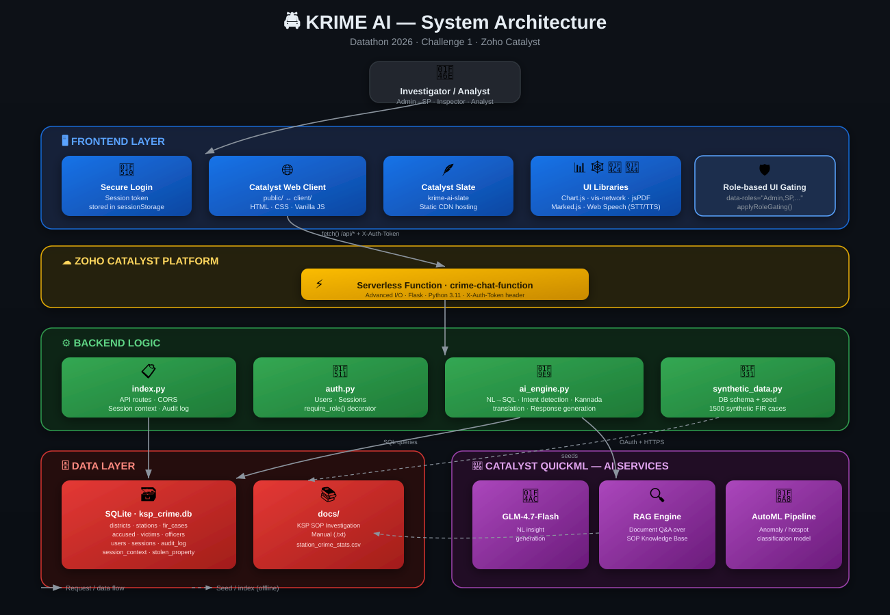

# 🚔 KRIME AI

> **Datathon 2026 · Challenge 1 · Zoho Catalyst**
> A conversational AI platform for exploring Karnataka State Police (KSP) crime data — supporting natural language queries in **English** and **Kannada**, powered end-to-end by Zoho Catalyst (Serverless Functions, Slate, and QuickML).

**🌐 Live Deployments:**
- **Slate frontend:** https://krime-ai-slate-jjmjpohd.onslate.in/
- **Web Client frontend:** https://krime-ai-60078097690.development.catalystserverless.in/app/index.html
- **Backend API:** https://krime-ai-60078097690.development.catalystserverless.in/server/crime-chat-function/

---

## 📖 Overview

KRIME AI lets police officers and analysts ask questions about crime data in plain language (English or Kannada) and get instant answers backed by SQL queries, charts, heatmaps, criminal network graphs, and AI-generated insights. Built for the Datathon 2026 challenge on Zoho Catalyst.

**Key capabilities:**
- 💬 Natural language chat interface (English + ಕನ್ನಡ), with **context-aware, multi-turn conversations** — follow-up questions like *"what about theft?"* automatically resolve entities (district/year/crime type) remembered from earlier in the chat
- 🎤 **Voice-enabled interaction** — speak your query (Web Speech `SpeechRecognition`, English/Kannada) and hear AI responses read back (`SpeechSynthesis`), toggleable via the 🔊 button
- 🔐 **Role-based secure access** — sign-in gated platform with 4 roles (Admin, SP, Inspector, Analyst), each with a different slice of permissions (e.g. only Admin can reseed the database; Analysts can't view the criminal network graph or export PDF reports)
- 🔎 NL → SQL translation with explainable, auditable queries (full audit trail, including which entities were carried over from context)
- 🧠 AI-generated natural-language insights on every answer via Catalyst QuickML (GLM-4.7-Flash)
- 📚 Retrieval-Augmented Generation (RAG) document Q&A over the KSP SOP Investigation Manual
- 🚨 AutoML-powered anomaly/hotspot detection pipeline flagging statistically unusual police stations
- 📊 Interactive dashboards (crime trends, district-wise stats, case status)
- 🗺️ Crime heatmaps by location and severity
- 🕸️ Criminal network graph (gang affiliations, co-accused links)
- 📄 Exportable investigation reports (PDF)

---

## 🏛️ Architecture



**Key architectural notes:**

1. **Auth flow**: Login issues a session token stored in `sessionStorage`; all subsequent API calls send it via `X-Auth-Token` (not `Authorization`, since Catalyst's gateway intercepts that header for its own OAuth validation).
2. **Role gating** happens at two layers: server-side via the `require_role()` decorator on Flask routes (source of truth), and client-side via `data-roles` attributes hiding UI elements (UX convenience).
3. **AI Engine** is the core NL→SQL translator: it detects intent, resolves conversational context (district/year/crime type), builds parameterized SQL, executes against SQLite, then optionally enriches the answer via QuickML's GLM model.
4. **Three separate QuickML integrations**: chat insights (GLM), document Q&A (RAG over the SOP manual), and anomaly detection (a trained AutoML classifier scanning station-level stats).
5. **Dual frontend hosting**: the same UI is deployed both to Catalyst Slate (static CDN hosting) and the Catalyst Web Client (same-origin with the function) — `public/` and `client/` are kept in sync.

---

## 🏗️ Project Structure

```
ksp-crime-ai/
├── catalyst.json                          ← Catalyst project config
├── DEPLOYMENT_GUIDE.md                    ← Full local + Catalyst deployment steps
│
├── client/                                ← Web client for Catalyst hosting (mirrors public/)
│   ├── index.html
│   ├── style.css
│   ├── app.js
│   └── client-package.json
│
├── public/                                ← Local dev static files (also deployed to Slate)
│   ├── index.html
│   ├── style.css
│   └── app.js
│
├── functions/
│   └── crime-chat-function/               ← Advanced I/O Python (Flask) function
│       ├── index.py                       ← Flask app entry point / API routes
│       ├── ai_engine.py                   ← NL→SQL translation, context resolution,
│       │                                    response generation, QuickML integrations
│       ├── auth.py                        ← Role-based secure access (users, sessions,
│       │                                    require_role() decorator)
│       ├── synthetic_data.py              ← Synthetic DB seed (1500 FIR cases)
│       ├── catalyst-config.json           ← Function config for Catalyst CLI
│       └── requirements.txt               ← Python dependencies
│
├── docs/                                  ← Source documents used by the RAG /
│   ├── KSP_SOP_Investigation_Manual.txt      AutoML QuickML features
│   └── station_crime_stats.csv
│
└── tests/
    └── test_greeting.py                   ← Unit tests
```

---

## 🚀 Quick Start (Local Development)

### Prerequisites
- Python 3.11+
- pip

### Setup

```powershell
cd ksp-crime-ai/functions/crime-chat-function
pip install -r requirements.txt

# Generate the synthetic database (first run only)
python synthetic_data.py

# Start the server
$env:PYTHONIOENCODING="utf-8"
python index.py
```

Open your browser at **http://localhost:3000**

Full instructions (including Zoho Catalyst cloud deployment) are in [`DEPLOYMENT_GUIDE.md`](./DEPLOYMENT_GUIDE.md).

🎬 **Presenting to judges?** See the [**Demo Guide**](./docs/DEMO_GUIDE.md) for a step-by-step walkthrough script with screenshots of every feature.

---

## 🔌 API Endpoints

| Endpoint | Method | Description |
|---|---|---|
| `/api/health` | GET | Health check |
| `/api/auth/login` | POST | Sign in with username/password, returns a bearer session token + user profile |
| `/api/auth/logout` | POST | Invalidate the current session token |
| `/api/auth/me` | GET | Validate a token and return the current user's profile |
| `/api/chat` | POST | Main conversational AI endpoint (context-aware; returns `context_used` / `resolved_entities`) — requires auth |
| `/api/reset-context` | POST | Clears a session's remembered conversation context (used by "New Chat") |
| `/api/dashboard` | GET | Key performance indicators |
| `/api/chart-data` | POST | Chart-ready aggregated data |
| `/api/network` | GET | Criminal network graph data |
| `/api/heatmap` | GET | Crime location heatmap points |
| `/api/suggest` | POST | Contextual follow-up query suggestions |
| `/api/export-pdf` | POST | Export conversation as report |
| `/api/rag-query` | POST | RAG document Q&A over the KSP SOP manual (Catalyst QuickML) |
| `/api/anomaly-scan` | GET/POST | Runs the AutoML anomaly-detection pipeline over all police stations |
| `/api/init-db` | POST | Re-seed the synthetic database |

### Context-aware conversations

`/api/chat` accepts a `session_id` and remembers the last-known **district**, **year**, and **crime type** discussed in that session. Follow-up questions that omit those entities automatically inherit them from earlier turns — e.g.:

1. *"How many crimes in Mysuru?"* → resolves district = Mysuru
2. *"What about theft?"* → reuses district = Mysuru (carried over) + crime type = Theft (fresh)

The response includes a transparent **"🧭 Continuing from earlier in this chat…"** note whenever context was carried over, and the audit trail records exactly which entity was remembered — keeping the AI explainable. Saying things like *"never mind"* or *"start over"* resets the carried context. Starting a "New Chat" in the UI also calls `/api/reset-context` and issues a fresh `session_id`.

### 🔐 Role-based secure access

The platform requires sign-in before any feature is usable. Authentication is a lightweight, self-contained username/password + bearer-token system (SQLite-backed, SHA-256+salt hashed passwords, 12-hour session TTL) — no external identity provider needed for the POC.

**Demo accounts** (shown on the login screen for judges):

| Username | Password | Role | Permissions |
|---|---|---|---|
| `admin` | `Admin@123` | Admin | Full access, including destructive ops (Reload/reseed DB) |
| `sp.blru` | `Sp@12345` | SP | Full investigative + analytics access |
| `inspector1` | `Inspector@123` | Inspector | Chat, dashboards, analytics, network graph, PDF export |
| `analyst1` | `Analyst@123` | Analyst | Read-only chat/dashboards/analytics — **no** network graph, PDF export, or anomaly scan (protects identifiable criminal-network data from non-investigative staff) |

Every sensitive API route is protected server-side by a `require_role(*roles)` decorator in `index.py` (see `functions/crime-chat-function/auth.py`), so permissions are enforced even if a user bypasses the UI. The frontend additionally hides role-restricted buttons/tabs via `data-roles="Role1,Role2"` attributes and the `applyRoleGating()` function in `app.js`.

### 🎤 Voice-enabled interaction

Click the 🎤 button to speak your query (Web Speech `SpeechRecognition`, supports English `en-IN` and Kannada `kn-IN`) — it auto-sends once you stop talking. AI responses are read back aloud via `SpeechSynthesis`; toggle voice replies on/off with the 🔊/🔇 button next to the chat toolbar. Voice input degrades gracefully (the mic button hides itself) in browsers without Web Speech API support.

---

## 🧪 Running Tests

```powershell
pip install pytest
pytest tests/
```

---

## 🛠️ Tech Stack

Built to satisfy the Datathon 2026 required Catalyst tech stack:

- **Frontend:** Zoho Catalyst **Slate** (static hosting) + Catalyst Web Client, HTML/CSS/vanilla JavaScript, Chart.js, vis-network, jsPDF, Marked.js
- **Backend:** Zoho Catalyst **Serverless Functions** (Advanced I/O) running Python + Flask
- **Database:** SQLite (synthetic FIR/crime dataset)
- **AI / LLM:** Zoho Catalyst **QuickML** — GLM-4.7-Flash for natural-language insights
- **Document Q&A:** Zoho Catalyst QuickML **RAG** (Retrieval-Augmented Generation) over the KSP SOP Investigation Manual
- **Anomaly/fraud detection:** Zoho Catalyst QuickML **AutoML pipeline** (custom-trained classifier flagging anomalous crime hotspot stations)
- **Languages supported:** English, Kannada (ಕನ್ನಡ)

---

## 📄 License

Built for Datathon 2026 · Challenge 1 · Zoho Catalyst. For educational/competition purposes.
