# 🎬 KRIME AI — Hackathon Demo Guide

> **Datathon 2026 · Challenge 1 · Zoho Catalyst**
> A step-by-step script for demoing KRIME AI to judges, with screenshots of every feature.

**Live App:** https://krime-ai-60078097690.development.catalystserverless.in/app/index.html
**Slate Frontend:** https://krime-ai-slate-jjmjpohd.onslate.in/
**Catalyst Console:** https://console.catalyst.zoho.in/baas/60078097690/index#/

---

## ⏱️ Suggested Demo Flow (8–10 minutes)

| # | Feature | Time |
|---|---|---|
| 1 | Secure Sign-In / Role-Based Access | 1 min |
| 2 | Conversational AI Chat (NL→SQL + Context) | 2 min |
| 3 | Dashboard & KPIs | 1 min |
| 4 | Predictive Analytics + AI Anomaly Detection | 1.5 min |
| 5 | Crime Heatmap | 0.5 min |
| 6 | Criminal Network Visualization | 1 min |
| 7 | Document Intelligence (RAG) | 1 min |
| 8 | Audit Trail / Explainability | 0.5 min |
| 9 | Voice Interaction + Role Restriction Demo | 1 min |

---

## 1️⃣ Secure Sign-In · Role-Based Access

Open the live app URL. Judges will see a gated login screen — **nothing is accessible without authentication**.

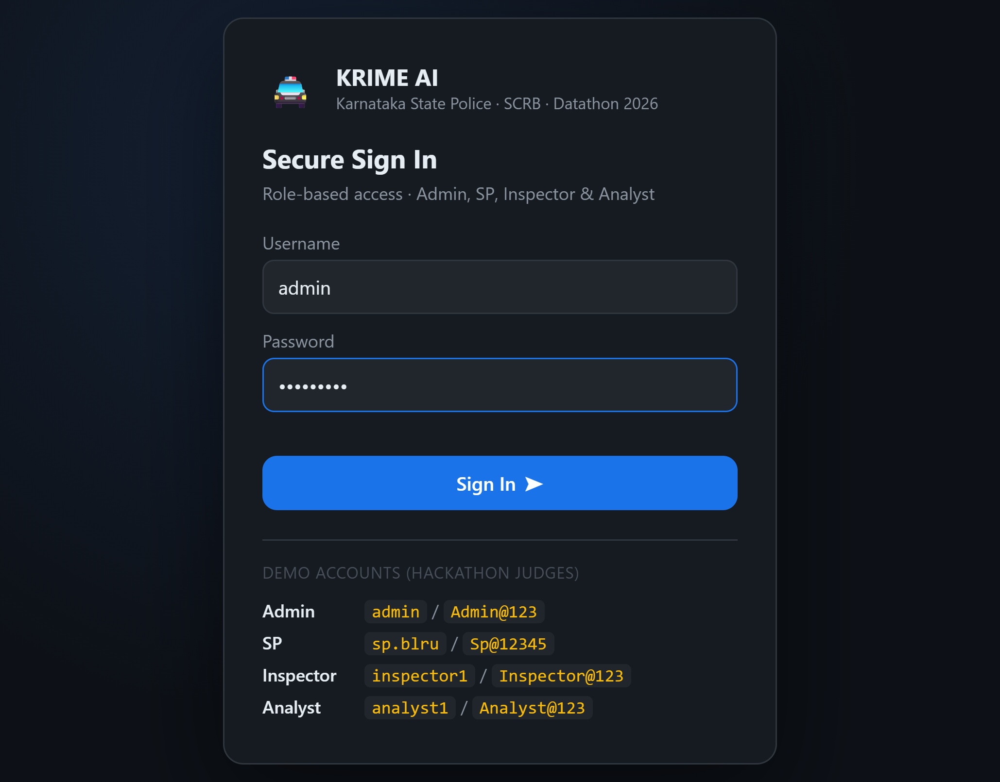

**Talking points:**
- 4 distinct roles: **Admin**, **SP**, **Inspector**, **Analyst** — each with a different permission slice.
- Demo credentials are shown directly on the screen for judges to try themselves.
- Enforcement happens **server-side** (`require_role()` decorator on every Flask route) — not just hidden UI, so it can't be bypassed by calling the API directly.

**Try it:** Sign in as `admin` / `Admin@123` for full access.

---

## 2️⃣ Conversational AI Chat — NL → SQL + Context Awareness

After signing in, you land on the **AI Chat** tab with example queries.

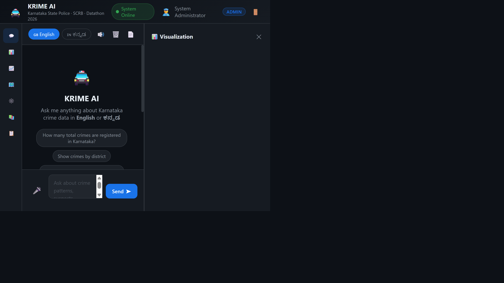

Type or click a suggestion, e.g. **"Show crimes by district"**. The AI:
1. Detects intent → builds parameterized SQL
2. Executes against the SQLite database (1,500 synthetic FIR records)
3. Generates a natural-language insight via **Catalyst QuickML (GLM-4.7-Flash)**
4. Shows the exact SQL query for transparency

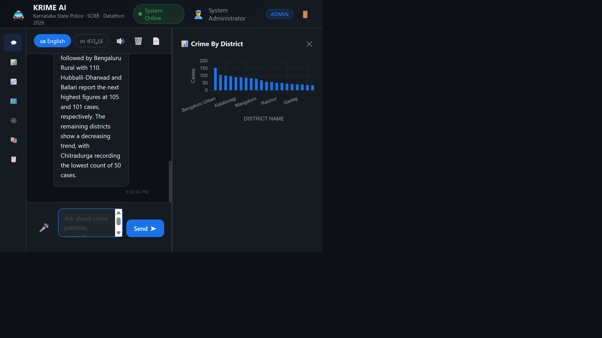

**Talking points:**
- Notice the **📊 chart panel** auto-renders alongside the answer.
- The **🧠 AI Insight** line is LLM-generated commentary on the data — not hardcoded.
- The chat stays clean and end-user friendly by design — the **exact SQL executed** for every answer is still fully available (untruncated) in the **📋 Audit Trail** tab for full explainability, without cluttering the conversation.

**Context-awareness demo:** Ask a follow-up like *"What about theft?"* without repeating the district — the AI remembers what you were just discussing and carries the context forward (visible later in the Audit Trail tab with a "🧭 Context carried over" badge).

**Bilingual demo:** Switch to 🇮🇳 ಕನ್ನಡ and ask `ಬೆಂಗಳೂರಿನಲ್ಲಿ ಎಷ್ಟು ಅಪರಾಧಗಳಾಗಿವೆ?` (How many crimes in Bengaluru?) — the same pipeline handles Kannada via translation.

---

## 3️⃣ Dashboard — Key Performance Indicators

Click **📊 Dashboard** in the sidebar.

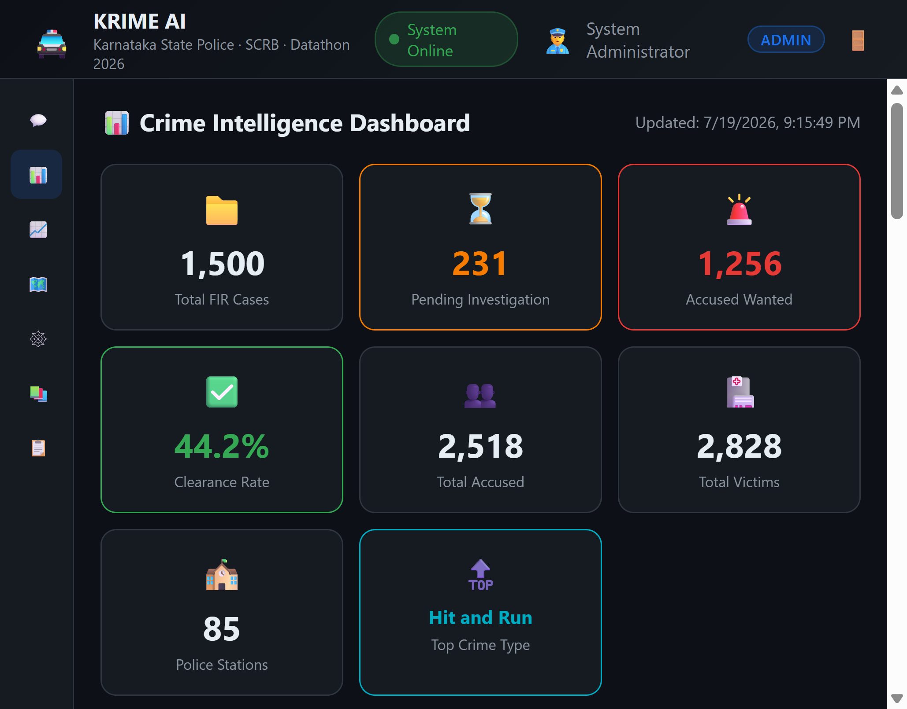

**Talking points:**
- 8 KPI cards: total cases, pending investigations, wanted accused, clearance rate, total accused/victims, station count, top crime type.
- 6 interactive Chart.js visualizations: yearly trend, crime type distribution, case status, top districts, arrest status, severity distribution.
- All data-driven from the live SQLite database — click **🔄 Reload DB** (Admin only) to reseed with fresh synthetic data live during the demo if desired.

---

## 4️⃣ Predictive Analytics + AI Anomaly Detection

Click **📈 Analytics**.

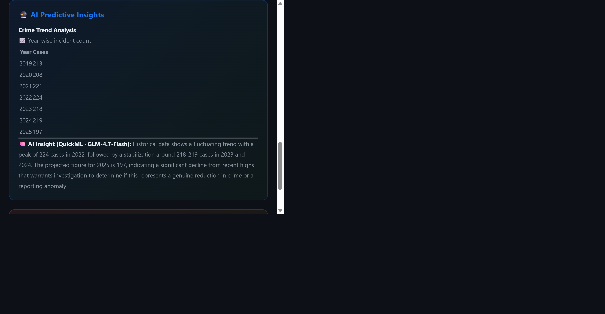

**Talking points:**
- **🔮 AI Predictive Insights** box: QuickML-generated commentary on year-over-year trends, flagging upward/downward trajectories as early warnings.
- Scroll down and click **"Scan Stations"** to trigger the **custom QuickML AutoML pipeline** — a trained classification model that flags police stations whose case volume/severity statistically deviates from normal.

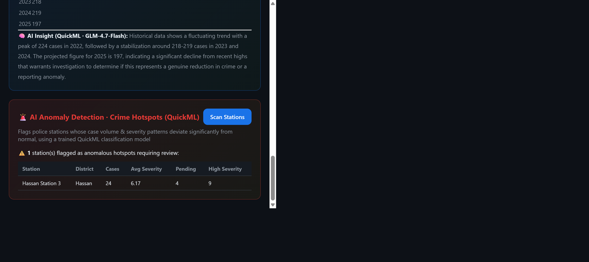

**Talking points:**
- This directly satisfies the *"custom pipeline builders for anomaly or fraud detection models"* requirement — it's a real trained AutoML endpoint, not a mock.
- Flagged stations (results vary per scan since severity is randomized in the synthetic dataset) show case count, average severity, pending count, and high-severity count — actionable for administrative review.

---

## 5️⃣ Crime Heatmap

Click **🗺️ Heatmap**.

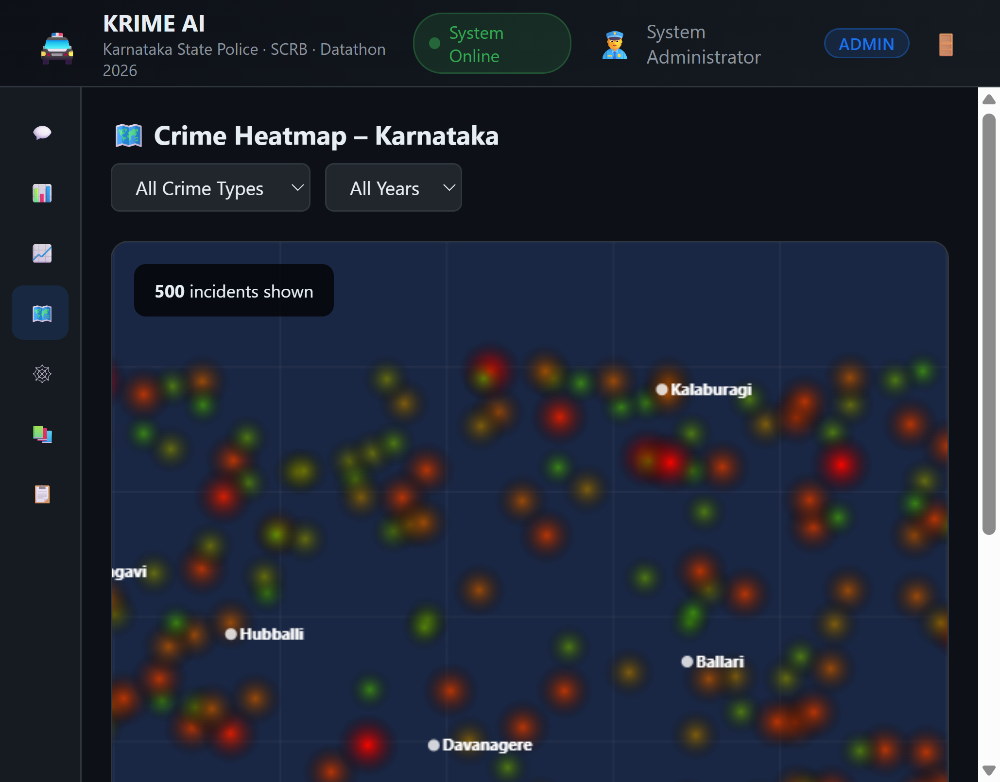

**Talking points:**
- Custom canvas-rendered heatmap of Karnataka with major cities labeled.
- Filter by crime type and year using the dropdowns — the glow intensity/color encodes severity.
- 500 incident points rendered live from `/api/heatmap`.

---

## 6️⃣ Criminal Network Visualization

Click **🕸️ Network** *(visible only to Admin/SP/Inspector — hidden for Analyst)*.

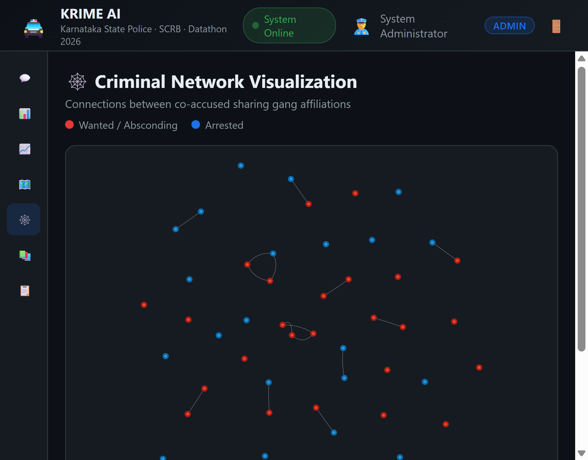

**Talking points:**
- Interactive force-directed graph (vis-network) showing co-accused sharing gang affiliations.
- 🔴 red nodes = Wanted/Absconding, 🔵 blue nodes = Arrested.
- Click any node to see full criminal profile details and connection count.
- This is the feature explicitly **role-gated** — demonstrates how sensitive identity-linked data is restricted from the Analyst role.

---

## 7️⃣ Document Intelligence — RAG over the KSP SOP Manual

Click **📚 Documents**.

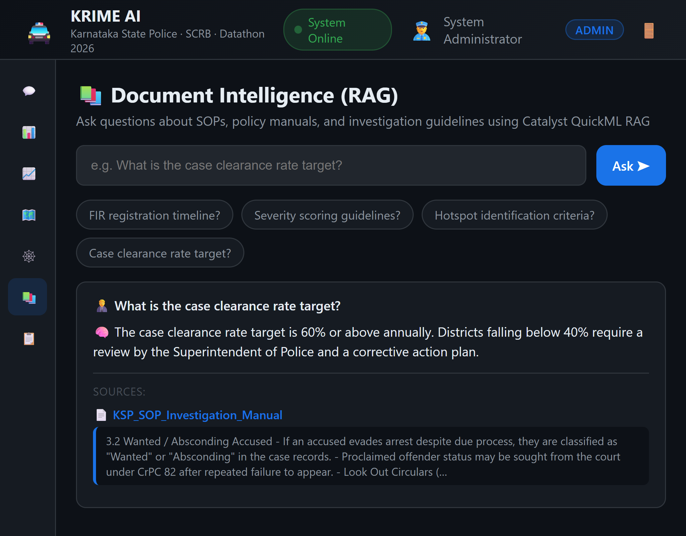

**Talking points:**
- Ask natural-language questions about the **KSP SOP Investigation Manual** (uploaded to Catalyst's QuickML Knowledge Base).
- Answers are **grounded** — the response cites the exact source document and snippet, not a hallucinated answer.
- Try: *"What is the case clearance rate target?"* → returns the real policy figure with a citation.

---

## 8️⃣ Audit Trail — Explainable AI

Click **📋 Audit Trail**.

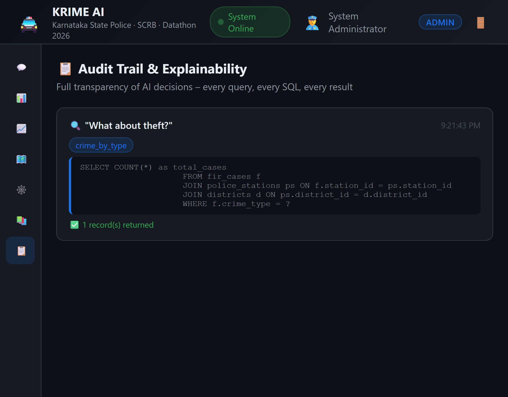

**Talking points:**
- Every single query is logged with: original question, detected intent, exact SQL executed, and result count.
- This is the "explainable AI with audit trails" requirement — nothing is a black box; every answer can be traced back to its exact query.
- Context-carried-over queries show a 🧭 badge indicating which entity (district/year/crime type) was remembered from earlier in the conversation.

---

## 9️⃣ Voice Interaction + Role-Based Restriction (side-by-side)

**Voice input/output:** Click the 🎤 mic button in the chat toolbar and speak a query (English or Kannada supported via `en-IN`/`kn-IN`). It auto-sends once you stop talking. The AI's response is read back aloud automatically — toggle with the 🔊/🔇 button.

**Role restriction:** Log out (🚪 icon, top-right) and sign back in as `analyst1` / `Analyst@123`. Notice:
- The **🕸️ Network** tab has disappeared from the sidebar.
- The **📄 Export PDF** button is gone from the chat toolbar and sidebar footer.
- The **🔄 Reload DB** button is gone (Admin-only).

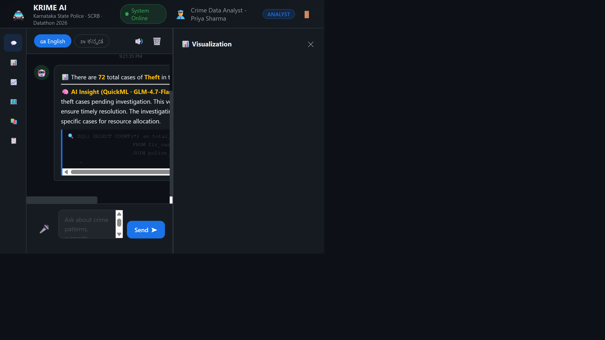

**Talking points:**
- Compare the sidebar icon count: **7 icons for Admin/SP/Inspector** vs **6 icons for Analyst** (Network hidden).
- This isn't just cosmetic — calling `/api/network` directly as an Analyst returns an HTTP **403 Forbidden** from the backend, proving the restriction is enforced server-side, not just hidden in the UI.

---

## 🏗️ Architecture Reference

See [`../README.md#-architecture`](../README.md) for the full system architecture diagram covering the frontend (Catalyst Slate + Web Client), backend (Flask Advanced I/O function), data layer (SQLite), and the three QuickML AI integrations (GLM chat insights, RAG document Q&A, AutoML anomaly detection).

---

## 🔑 Quick Reference — Demo Accounts

| Role | Username | Password | Notable Restrictions |
|---|---|---|---|
| Admin | `admin` | `Admin@123` | None — full access incl. DB reseed |
| SP | `sp.blru` | `Sp@12345` | None — full investigative access |
| Inspector | `inspector1` | `Inspector@123` | No DB reseed |
| Analyst | `analyst1` | `Analyst@123` | No Network graph, PDF export, Anomaly scan, DB reseed |

---

## 💬 Sample Queries to Showcase Range

| Category | Query |
|---|---|
| Aggregate | `How many total crimes are registered in Karnataka?` |
| District breakdown | `Show crimes by district` |
| Trend | `Show crime trend from 2019 to 2025` |
| Hotspot | `Top crime hotspot stations` |
| Context follow-up | `How many crimes in Mysuru?` → then `What about theft?` |
| Predictive | `Predict crime trend for next months` |
| Kannada | `ಬೆಂಗಳೂರಿನಲ್ಲಿ ಎಷ್ಟು ಅಪರಾಧಗಳಾಗಿವೆ?` |
| RAG | `What is the case clearance rate target?` (Documents tab) |
